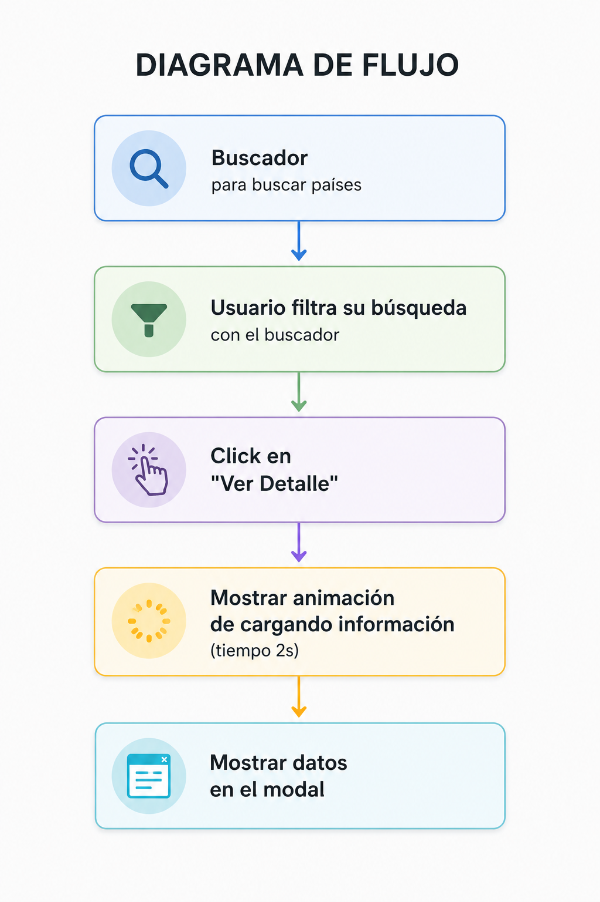

# COVID-19 API

Este proyecto permite visualizar estadísticas globales del COVID-19. Utiliza solamente JavaScript, html, css. Y consume datos de una API externa, ofreciendo una experiencia de usuario fluida con tiempos de carga simulados.

## Diagrama de Flujo del Sistema

Carga Inicial: Se realiza la petición fetch a la API de disease.sh.

Renderizado: Se muestra las tarjetas de todos los países en el contenedor principal.

Filtrado: El usuario puede buscar países específicos.

Selección: Al hacer clic en "Ver Detalle", se activa el modal.

Espera: Se muestra un mensaje de "Cargando informacion" durante 2 segundos usando async/await.

Finalización: Se muestra los datos (bandera, casos, muertes) en la carta central del modal.

## Conexión de Archivos

El proyecto utiliza un sistema de **Módulos de JavaScript**. Esto significa que cada archivo tiene una función específica y se conectan entre sí mediante import y export, el principal archivo se llama **principal.js**.

#### Estilos (CSS)
Todos los estilos nacen en la carpeta **archivos css** y se cargan en el **index.html**
* **base.css**: practicamente todos los estilos del header y el main.
* **animacion.css**: contiene las animaciones de las fotos. 
* **modal.css**: tiene el diseño de la carta que se muestra cuando se clickea ver detalles.
* **responsive.css**: Asegura que el buscador y las tarjetas se adapten a celulares y computadoras.

#### JavaScript (script)
Los archivos en la carpeta javascript trabajan en cadena:

* **datos.js**: Es el encargado de la conexión externa. Hace el *fetch* a la API de disease.sh y exporta los resultados a **principal.js**.
* **logica.js**: Recibe los datos de *datos.js* y los prepara con una funcionque muestra la informacion de la api en ese modal.
* **buscador.js**: Maneja exclusivamente el evento de buscar paises (input) para filtrar la lista de paises.
* **interfaz.js**: Crea el HTML de las tarjetas y maneja la apertura y cierre del modal.
* **principal.js**: Importa a todos los anteriores, coordina el inicio de la app y une la lógica con la interfaz.

### Flujo de Importación:
**datos.js** contiene la api y se realiza una funcion en logica.js que recibe esos datos, los archivos js se exportan a **principal.js** y principal js esta vinculado a **index.html (Muestra)**

## Tecnologías Utilizadas

HTML5: Estructura semántica del sitio.

CSS3: Estilos, animaciones de carga y diseño responsivo.

JavaScript: Manipulación del DOM, lógica de filtrado y gestión de eventos.

## para ejecutar

Para ejecutar este proyecto localmente:

Clona el repositorio.

Abre el archivo index.html 

Asegúrate de tener conexión ya que este esta conectado a una API para que pueda mostrar los datos.

## Autor

Sergio Ricardo Ajú Miranda

GitHub: 2026sergio

